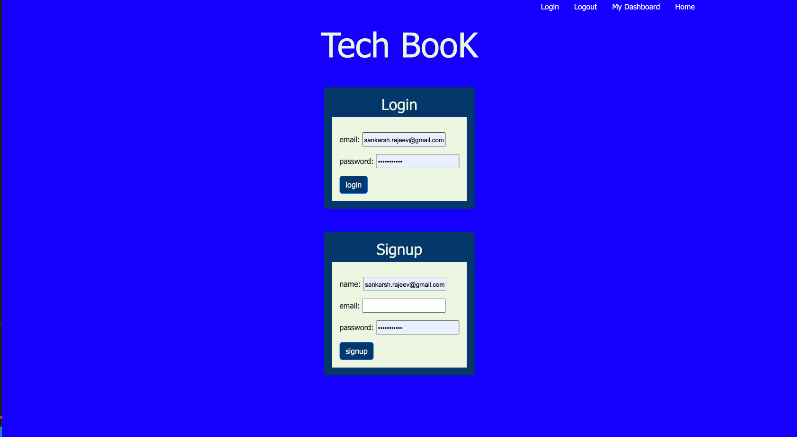
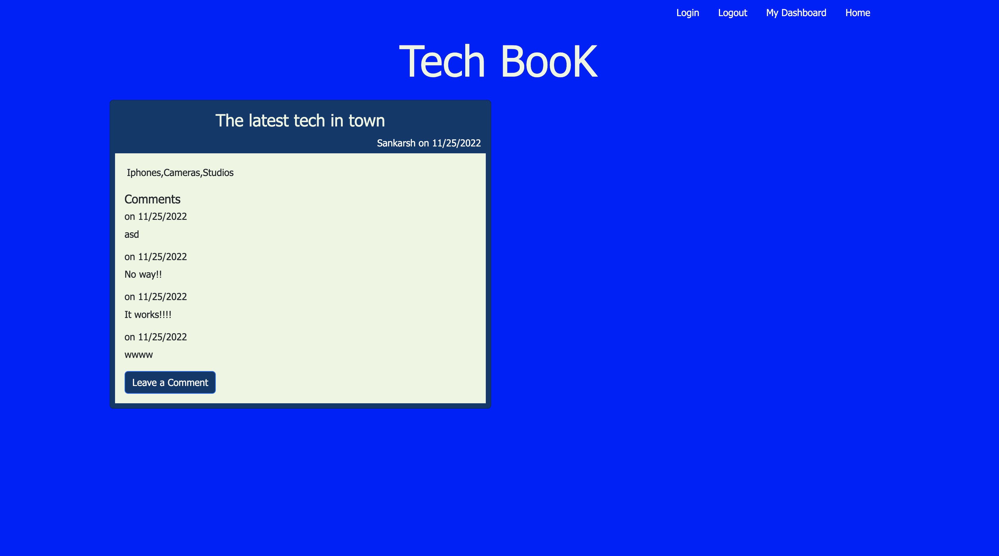

# tech-book

## Description

This is a project that was built using Express, SQl, Sequelize and Handlebars.js. I ejoyed debugging this code throughout and put me through a tough challenge. Thanks to this challenge i was able to understand the use MVC Frameworks and how it can used in the realworld applications.

## Installation

Use the link below to access the webpage. 

https://git.heroku.com/my-tech-book.git

## Usage
 
This is how our webpage looks 
   md
   md
   

